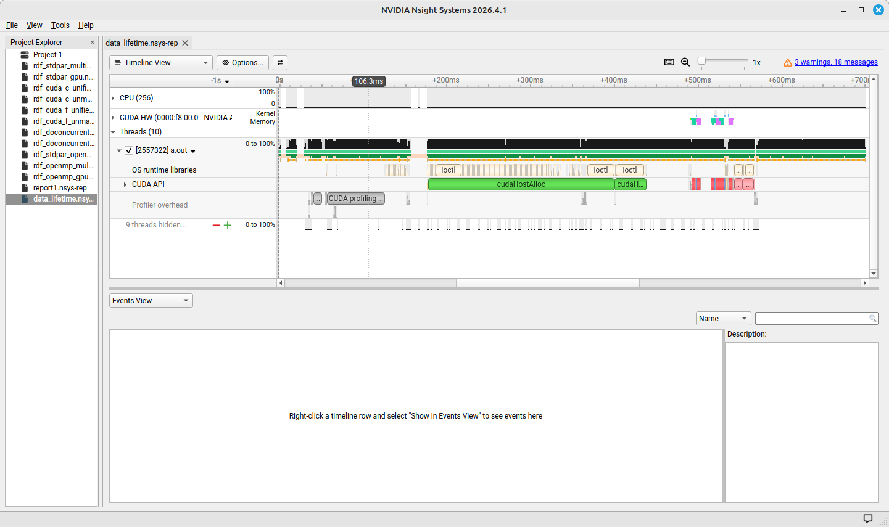
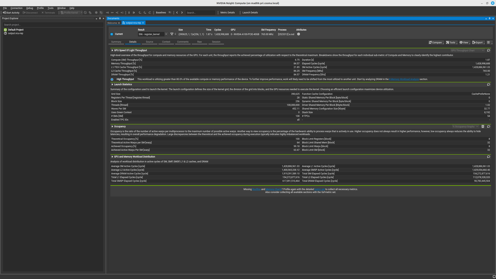
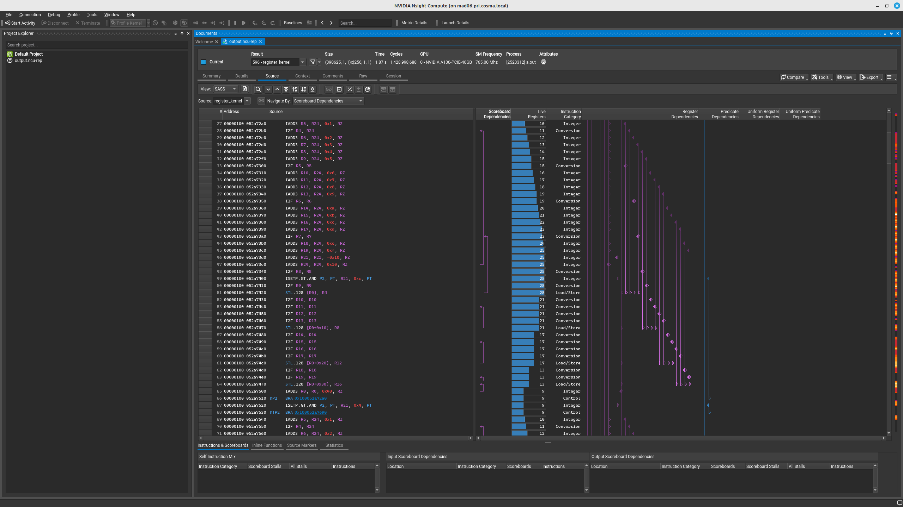
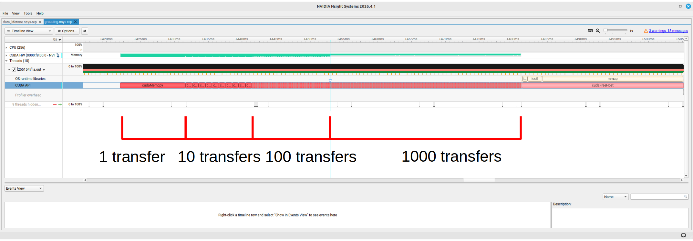
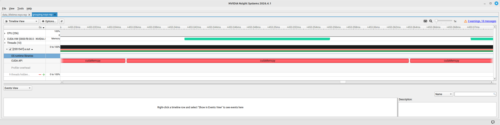
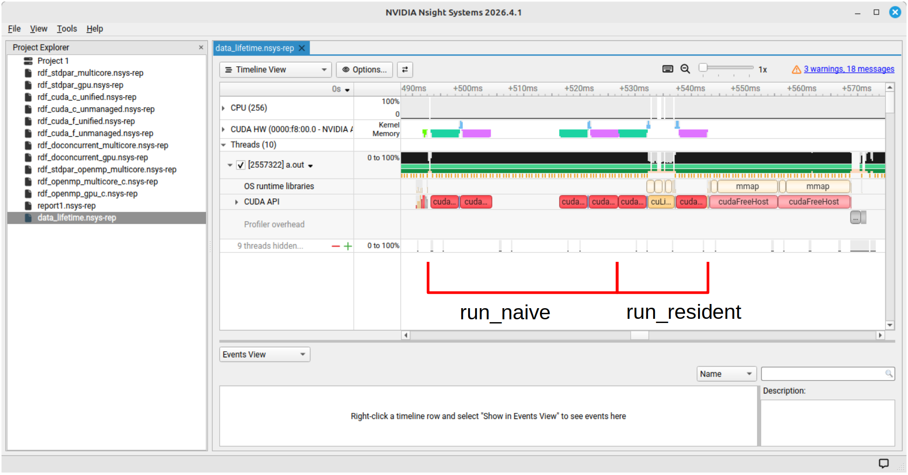

---
author:
  - Duncan Leggat
format: revealjs
date: 2026-09-15
title: Introducing GPU Profilers
subtitle: GPPT Workshop
filters:
  - arrows
---

# GPU Profiler

## What *is* a profiler?

- A tool that runs a command or program, and collects data and metrics about its performance.
- Event records are collected through hardware counters, and provide performance information including:
  - Timing, hardware utilisation, instructions, call hierarchy and more.
- This presented information can then be used to engineer better performance from our code.

## Profiling vs Benchmarking

Related but distinct concepts that sometimes get used interchangeably.
Both measure performance of code, but with different goals.

:::: {.columns}

::: {.column width="45%"}
**Profiling**

Measuring performance metrics with the aim of understanding how the code works, and ultimately optimise performance.
:::

::: {.column width="10%"}
:::

::: {.column width="45%"}
**Benchmarking**

Measures the performance of existing code. 

Useful for comparing code on different hardwares, or testing the scaling of our programs.
:::

::::


## What types of profiler are available for GPU?

:::: {.columns}

::: {.column width="45%"}
**Systems**

Profiles the complete operation of the program from start to finish


*Highlights*

- Program timeline
- Data transfers
- Kernel overheads and runtimes
:::

::: {.column width="10%"}
:::

::: {.column width="45%"}
**Compute**

Provides detailed information about the individual kernels

*Highlights*

- GPU occupancy
- Throughputs
- Memory usage metrics
:::

::::

## How do we use profilers to optimise? {style="text-align: center;"}

[Run profiler on workflow]{.absolute top=150 left="33%"}

:::: {.columns .absolute top=300}

::: {.column width="45%"}
Implement optimisations
:::

::: {.column width="10%"}
:::

::: {.column width="45%"}
Check profiler outputs for optimisation stratergies
:::

::::






# Nvidia's Nsight profilers

# Nsight Systems



## Running Nsight Systems

:::: {.columns}

::: {.column width="45%"}
**Command line**

`nsys profile [application name]`

Produces a report file that can be used for later analysis

Useful when working on a system with no x window access
:::

::: {.column width="10%"}
:::

::: {.column width="45%"}
**In GUI**

`nsys-ui`

Launches the Systems GUI.

Analysis can be run directly from the GUI.
:::

::::

## Systems features: The timeline


## Practical time! (5-10 minutes)

[link to directory]

Run Nsights Systems on the provided code!

```sh
./build.sh               # Build the application
nsys profile a.out 32    # Create a profile report of the code
nsys-ui report1.nsys-rep # Examine the report in the GUI
```

Tasks:

- Familiarise yourself with the timeline view.
- Use the CUDA HW track to identify where the GPU is carrying out work.
- Use the CUDA API track check which CUDA functions are being called.

Record in the shared document the order and time taken of actions on the device.

## Using Nsight Systems

- Shows run times, data transfers and kernel overheads.
- First port of call for sanity checking programs.
- Graphical representation of the code's running.
- Timeline helps quickly spot if something is obviously wrong;
  - Many data transfers,
  - Long-running kernels.
- Identifying longer kernels, or kernels that are called a lot, can provide potential optimisation targets

# Nsight Compute



## Using Nsight Compute

:::: {.columns}

::: {.column width="45%"}
**Command line**

`ncu <options> [application name]`

By default, provides a minimal performance analysis in the command line.

Has an SQL database behind the scenes that can be queried for complex analysis.
:::

::: {.column width="10%"}
:::

::: {.column width="45%"}
**In GUI**

`ncu-ui`

Launches the Compute GUI.

Analysis can be run directly from the GUI.

Provides detailed metrics simply.
:::

::::

## Exercise: Run Nsight Conpute through CLI (5 mins)

Use Nsight Compute on the same code.

```sh
ncu -k axpy_kernel a.out 32
```

*`-k` here filters the output to only show the desired kernels.*

Make sure the command runs, and take a look at the output.
Write down the kernel's execution time in the shared document.

## Using Nsights Compute

Important concepts you should have seen:

- Compute and memory throughputs
- Launch parameters
- Occupancy

Additional information available in the GUI:

- Source view, instructions and compute resources

*Note:*The profiler offers hints on improving performance.

## Compute concepts: Speed of Light Throughput

```sh
    ----------------------- ----------- ----------------
    Metric Name             Metric Unit     Metric Value
    ----------------------- ----------- ----------------
    DRAM Frequency                  Ghz             1.21
    SM Frequency                    Mhz           765.00
    Elapsed Cycles                cycle    1,428,679,972
    Memory Throughput                 %            84.59
    DRAM Throughput                   %            84.59
    Duration                          s             1.87
    L1/TEX Cache Throughput           %            21.85
    L2 Cache Throughput               %            86.27
    SM Active Cycles              cycle 1,428,575,871.03
    Compute (SM) Throughput           %             6.75
    ----------------------- ----------- ----------------

```

Memory and compute usage of the resource as a ratio against the maximum possible of the hardware

## Compute concepts: Launch Statistics

```sh
    Section: Launch Statistics
    -------------------------------- --------------- ---------------
    Metric Name                          Metric Unit    Metric Value
    -------------------------------- --------------- ---------------
    Block Size                                                   256
    Function Cache Configuration                     CachePreferNone
    Grid Size                                                 16,384
    Registers Per Thread             register/thread              16
    Shared Memory Configuration Size           Kbyte           32.77
    Driver Shared Memory Per Block       Kbyte/block            1.02
    Dynamic Shared Memory Per Block       byte/block               0
    Static Shared Memory Per Block        byte/block               0
    # SMs                                         SM             108
    Stack Size                                                 1,024
    Threads                                   thread       4,194,304
    # TPCs                                                        54
    Enabled TPC IDs                                              all
    Uses Green Context                                             0
    Waves Per SM                                               18.96
    -------------------------------- --------------- ---------------
```

## Compute concepts: Launch Statistics

```sh {code-line-numbers="5,7"}
    Section: Launch Statistics
    -------------------------------- --------------- ---------------
    Metric Name                          Metric Unit    Metric Value
    -------------------------------- --------------- ---------------
    Block Size                                                   256
    Function Cache Configuration                     CachePreferNone
    Grid Size                                                 16,384
    Registers Per Thread             register/thread              16
    Shared Memory Configuration Size           Kbyte           32.77
    Driver Shared Memory Per Block       Kbyte/block            1.02
    Dynamic Shared Memory Per Block       byte/block               0
    Static Shared Memory Per Block        byte/block               0
    # SMs                                         SM             108
    Stack Size                                                 1,024
    Threads                                   thread       4,194,304
    # TPCs                                                        54
    Enabled TPC IDs                                              all
    Uses Green Context                                             0
    Waves Per SM                                               18.96
    -------------------------------- --------------- ---------------
```

Grid dimensions (as defined by the launch parameters)

## Compute concepts: Launch Statistics

```sh {code-line-numbers="8"}
    Section: Launch Statistics
    -------------------------------- --------------- ---------------
    Metric Name                          Metric Unit    Metric Value
    -------------------------------- --------------- ---------------
    Block Size                                                   256
    Function Cache Configuration                     CachePreferNone
    Grid Size                                                 16,384
    Registers Per Thread             register/thread              16
    Shared Memory Configuration Size           Kbyte           32.77
    Driver Shared Memory Per Block       Kbyte/block            1.02
    Dynamic Shared Memory Per Block       byte/block               0
    Static Shared Memory Per Block        byte/block               0
    # SMs                                         SM             108
    Stack Size                                                 1,024
    Threads                                   thread       4,194,304
    # TPCs                                                        54
    Enabled TPC IDs                                              all
    Uses Green Context                                             0
    Waves Per SM                                               18.96
    -------------------------------- --------------- ---------------
```

Number of registers that each thread uses (counted during kernel running)

## Compute concepts: Launch Statistics

```sh {code-line-numbers="9-12"}
    Section: Launch Statistics
    -------------------------------- --------------- ---------------
    Metric Name                          Metric Unit    Metric Value
    -------------------------------- --------------- ---------------
    Block Size                                                   256
    Function Cache Configuration                     CachePreferNone
    Grid Size                                                 16,384
    Registers Per Thread             register/thread              16
    Shared Memory Configuration Size           Kbyte           32.77
    Driver Shared Memory Per Block       Kbyte/block            1.02
    Dynamic Shared Memory Per Block       byte/block               0
    Static Shared Memory Per Block        byte/block               0
    # SMs                                         SM             108
    Stack Size                                                 1,024
    Threads                                   thread       4,194,304
    # TPCs                                                        54
    Enabled TPC IDs                                              all
    Uses Green Context                                             0
    Waves Per SM                                               18.96
    -------------------------------- --------------- ---------------
```

Shared memory. From launch parameters and measured in use.

## Compute concepts: Occupancy

The ratio of active warps to the theoretical maximum possible on the hardware.

```sh
    Section: Occupancy
    ------------------------------- ----------- ------------
    Metric Name                     Metric Unit Metric Value
    ------------------------------- ----------- ------------
    Block Limit SM                        block           32
    Block Limit Registers                 block           16
    Block Limit Shared Mem                block           32
    Block Limit Warps                     block            8
    Theoretical Active Warps per SM        warp           64
    Theoretical Occupancy                     %          100
    Achieved Occupancy                        %        64.83
    Achieved Active Warps Per SM           warp        41.49
    ------------------------------- ----------- ------------
```

## Compute concepts: Occupancy

The ratio of active warps to the theoretical maximum possible on the hardware.

```sh {code-line-numbers="10-11"}
    Section: Occupancy
    ------------------------------- ----------- ------------
    Metric Name                     Metric Unit Metric Value
    ------------------------------- ----------- ------------
    Block Limit SM                        block           32
    Block Limit Registers                 block           16
    Block Limit Shared Mem                block           32
    Block Limit Warps                     block            8
    Theoretical Active Warps per SM        warp           64
    Theoretical Occupancy                     %          100
    Achieved Occupancy                        %        64.83
    Achieved Active Warps Per SM           warp        41.49
    ------------------------------- ----------- ------------
```
Theoretical = maxmimum possible given the properties of the kernel
Achieved = Real occupancy (given thread overheads etc.)

## Compute concepts: Occupancy

The ratio of active warps to the theoretical maximum possible on the hardware.

```sh {code-line-numbers="5"}
    Section: Occupancy
    ------------------------------- ----------- ------------
    Metric Name                     Metric Unit Metric Value
    ------------------------------- ----------- ------------
    Block Limit SM                        block           32
    Block Limit Registers                 block           16
    Block Limit Shared Mem                block           32
    Block Limit Warps                     block            8
    Theoretical Active Warps per SM        warp           64
    Theoretical Occupancy                     %          100
    Achieved Occupancy                        %        64.83
    Achieved Active Warps Per SM           warp        41.49
    ------------------------------- ----------- ------------
```

Fixed hardware cap on the number of blocks an SM can hold

## Compute concepts: Occupancy

The ratio of active warps to the theoretical maximum possible on the hardware.

```sh {code-line-numbers="6"}
    Section: Occupancy
    ------------------------------- ----------- ------------
    Metric Name                     Metric Unit Metric Value
    ------------------------------- ----------- ------------
    Block Limit SM                        block           32
    Block Limit Registers                 block           16
    Block Limit Shared Mem                block           32
    Block Limit Warps                     block            8
    Theoretical Active Warps per SM        warp           64
    Theoretical Occupancy                     %          100
    Achieved Occupancy                        %        64.83
    Achieved Active Warps Per SM           warp        41.49
    ------------------------------- ----------- ------------
```

The SM's register file divided by the registers each block needs.

## Compute concepts: Occupancy

The ratio of active warps to the theoretical maximum possible on the hardware.

```sh {code-line-numbers="7"}
    Section: Occupancy
    ------------------------------- ----------- ------------
    Metric Name                     Metric Unit Metric Value
    ------------------------------- ----------- ------------
    Block Limit SM                        block           32
    Block Limit Registers                 block           16
    Block Limit Shared Mem                block           32
    Block Limit Warps                     block            8
    Theoretical Active Warps per SM        warp           64
    Theoretical Occupancy                     %          100
    Achieved Occupancy                        %        64.83
    Achieved Active Warps Per SM           warp        41.49
    ------------------------------- ----------- ------------
```

The SM's shared memory divided by the amount each block requests.

## Compute concepts: Occupancy

The ratio of active warps to the theoretical maximum possible on the hardware.

```sh {code-line-numbers="8"}
    Section: Occupancy
    ------------------------------- ----------- ------------
    Metric Name                     Metric Unit Metric Value
    ------------------------------- ----------- ------------
    Block Limit SM                        block           32
    Block Limit Registers                 block           16
    Block Limit Shared Mem                block           32
    Block Limit Warps                     block            8
    Theoretical Active Warps per SM        warp           64
    Theoretical Occupancy                     %          100
    Achieved Occupancy                        %        64.83
    Achieved Active Warps Per SM           warp        41.49
    ------------------------------- ----------- ------------
```

The SM's maximum number of warps divided by the warps per block.

## Occupancy caveat

*Higher occupancy is **not** always higher performance!*

Some lower occupancy scenarios that run more efficiently:

- Threads that require many registers but few memory accesses.
- Lower thread counts running on properly coalesced memory.

## Compute concepts: Memory workload

```sh
    Section: GPU and Memory Workload Distribution
    -------------------------- ----------- ------------
    Metric Name                Metric Unit Metric Value
    -------------------------- ----------- ------------
    Average DRAM Active Cycles       cycle    13,501.20
    Total DRAM Elapsed Cycles        cycle   39,540,736
    Average L1 Active Cycles         cycle   618,614.50
    Total L1 Elapsed Cycles          cycle   67,216,096
    Average L2 Active Cycles         cycle      194,794
    Total L2 Elapsed Cycles          cycle   48,816,560
    Average SM Active Cycles         cycle   618,614.50
    Total SM Elapsed Cycles          cycle   67,216,096
    Average SMSP Active Cycles       cycle   618,525.90
    Total SMSP Elapsed Cycles        cycle  268,864,384
    -------------------------- ----------- ------------
```

Displays the number of memory cycles for the kernel.

We won't be using this information in the workshop.

## Exercise: Playing with occupancy!

Reminder of the factors that impact occupancy:

- Hardware limits in the GPU,
- Grid and block size,
- Shared memory usage,
- Registers per thread.

We will now go through a set of exercises that demonstrate these factors.

## Occupancy exercises (20 minutes)

**1) Grid and block size**

- `launch_param_size` directory - where you already are!

**2) Register use per thread**

- `registers` directory

**3) Shared memory per block**

- `shared_memory` directory

The code for all exercises vary a single parameter that controls the amount of the resource the kernels use - check the `README.md` in each directory for more information!

Make a note of the parameters you test, and how they impact the runtime and occupancy.

## Occupancy I: Grid and block size

On an A100, which has a maximum of 32 blocks per streaming multiprocessor, changing the block sizes of the example gives the following occupancies:

| Threads/block | Warps/block | Expected occupancy | What it shows                                                               |
|--------------:|------------:|-------------------:|-----------------------------------------------------------------------------|
|            32 |           1 |               ~50% | capped by the 32-blocks-per-SM limit, not warps — small blocks hurt         |
|            64 |           2 |              ~100% | just enough warps per block to fill the 64 slots                            |
|           128 |           4 |              ~100% | fewer, larger blocks, still 64 warps                                        |
|           256 |           8 |              ~100% | conventional full-occupancy case                                            |
|           768 |          24 |               ~75% | 64 is not divisible by 24, so only 2 blocks fit and 16 warp slots stay idle |
|          1024 |          32 |              ~100% | 2 blocks of 32 warps fill all 64 slots                                      |

## Occupancy II: Registers

You should find that increasing `N` in the program decreases occupancy.

| `N` | Register/thread | Duration (ms) | Occupancy (%) |
| --- | --------------- | ------------- | --------- |
| 2 | 16 | 159 | 100 |
| 8 | 44 | 290 | 62  |
| 50 | 206 | 321 | 12.5 |

- The number of registers that will be used by a thread is often unintuitive.
- A profiler will measure the use directly, making it a valuable tool here.

## Occupancy III: Shared Memory

Higher use of shared memory causes lower occupancy.

| SHARED_STRIDES | Memory size per block | Blocks/SM | A100 Occupancy |
|----------------|----------------------:|-----------|---------------:|
| 96             |                  49kB | 3         |         18.75% |
| 64             |                  32kB | 4         |            25% |
| 32             |                  16kB | 9         |         56.25% |
| 24             |                  12kB | 12        |            75% |
| 20             |                  10kB | 14        |          87.5% |
| 18             |                   9kB | 16        |           100% |

- Useful when you need a lot of data re-use
  - GPUs, unlike CPUs, are *NOT* good at caching memory.
  - Loops can benefit from using shared memory when you would think L2 cache should be used
- Too much use will impact performance!

## Compute concepts: Instruction and source view



Compute offers a detailed view of the instructions run in a kernel and the resourse use at each step.

**NOTE!** This is outside the scope of this workshop, and is being presented for completion!

# Profiling for performance

Interactive examples of some key concepts in performant GPU code.

The concepts we will be investigating:

- Memory coalescence
- Branching in kernels
- Minimising data transfers

## Memory coalescence exercise (15 minutes)

Warps work most efficiently when each thread accesses sequential ('coalesced') memory.

To demonstrate this, we will profile the program in the `indexing` directory.

The program contains two kernels that perform the same summation operation on a 256 x 2^20 data structure, but with different memory access patterns:

- `row_sum_strided` accesses its rows contiguously, in the manner that would be optimised for CPU.
- `row_sum_coalesced` uses a transposed indexing so that adjacent threads are accessing memory 1 float apart.

## Memory coalescence discussion

| Kernel | duration (us) |
| ------ | ------------- |
| `row_sum_strided` | 3280 |
| `row_sum_coalesced` | 764 |

The coalesced accesses are substantially faster.

Takeaways:

- Best practice is to design data to run well on the GPU from the start.
- It *might* be useful to spend time/compute to repack data into coalesced objects.
- Deciding which strategy is optimal is where the profiling cycling comes into its own!

## Branching in kernels

When threads in a warp take different branches in a kernel, the GPU runs both branches on every thread.
A lot of branching in kernels can therefore hurt our performance.

Let's look at a practical example, in the `branching` directory, which demonstrates this impact of branching on kernel run-time.

- Each thread in the `branching_kernel` choses a branch based on its ID and an input parameter
- Changing the input parameter changes how coherent the warps are in branch selection.
  - 1 = Divergent warps
  - 32 = Coherent warps

## Branching exercise discussion

| Coherence_parameter | Runtime (us) |
| --------------------| ------------ |
| 1 (divergent warps) | 813 |
| 16 | 813 |
| 32 (coherent warps) | 418 |

- With divergent threads in the warp, the kernel runs each branch for every thread.
- When our warps coherently choose the same branch, we only need to run one of the branches, and our run time is halved.
- We can leverage this in the design of data structures and control paths, e.g. grouping boundary conditions together.

## Minimising data transfers (30 minutes)

You have probably heard that data transfers between host and device are very costly to the performance of your code.

Now that you're well-practiced in using a profiler, you can prove this for yourself!

There are two demonstrations of how data transfers can impact performance to explore:

**1) Grouping transfers**

- In the `grouping_transfers` directory.
- Demonstrates how runtime is impacted by splitting data transfers.

**2) Avoiding additional transfers**

- In the `data_lifetime` directory.
- Improve runtime using innefficient GPU code to avoid extra data transfers

## Grouped transfers I

Making one large transfer is more efficient than making many, smaller transfers.





## Grouped transfers II

Using the sqlite functionality of Systems we can produce a table that calculates the transfer overheads:

| bytes   |   calls | api (ns)  |  gpu (ns)  | overhead (ns) |
|---------|  ----- | -------- | -------- | ----------- |
|128000 |    1000 |  27835646  | 13919100 | 13916546   |
|1280000 |   100  |  11496019  | 10038196 | 1457823    |
|12800000 |  10   |  9811789   | 9649268  | 162521     |
|128000000 | 1    |  9663991   | 9612501  | 51490      |

**Remember!**
- The same overheads will also happen when launching kernels.
- Launching many small transfers (or kernels!) in a loop is a very good way to run into large overheads, slowing down your code!

## Data lifetime

Because data transfers are very time-expensive, it is good practice to leave memory on the GPU for as long as possible.

Sometimes, this means creating kernels for code that could be better optimised on CPU but is part of the way through a GPU workflow.
The inefficient calculations on GPU might still be faster than a transfer to and from the host!

## Data lifetime exercise (15 minutes)

Consider the program in the `data_lifetime` directory.

The workflow of the program is:

- Carry out a Fast Fourier Transform (FFT) on a large data object - well suited to GPU,
- Re-normalise the array - a task better suited to CPU,
- Reverse the FFT on the GPU.

Two versions of this workflow are presented:

- `run_naive`, which transfers the data back to the CPU for the normalisation calculations,
- `run_resident`, which uses a device kernel for the normalisation.

Run Nsight Systems on this program to see how the two versions perform.

## Data lifetime exercise discussion



## Data lifetime exercise timing table

```sh
 ** CUDA GPU Kernel Summary (cuda_gpu_kern_sum):

 Time (%)  Total Time (ns)  Instances  Avg (ns)   Med (ns)   Min (ns)  Max (ns)  StdDev (ns)                Name
 --------  ---------------  ---------  ---------  ---------  --------  --------  -----------  ------------------------------------
     95.6        2,000,548          8  250,068.5  249,601.0   227,873   271,585     21,636.6  void regular_fft_factor<...>  (cuFFT)
      4.4           92,896          1   92,896.0   92,896.0    92,896    92,896          0.0  normalise(double2 *, double, int)
```

```sh
 ** CUDA GPU MemOps Summary (by Time) (cuda_gpu_mem_time_sum):

 Time (%)  Total Time (ns)  Count   Avg (ns)     Med (ns)    Min (ns)   Max (ns)   StdDev (ns)           Operation
 --------  ---------------  -----  -----------  -----------  ---------  ---------  -----------  ----------------------------
     58.2       21,262,050      6  3,543,675.0  3,674,118.0      1,824  8,871,150  3,448,662.2  [CUDA memcpy Host-to-Device]
     41.8       15,252,761      3  5,084,253.7  5,084,104.0  5,083,945  5,084,712        404.8  [CUDA memcpy Device-to-Host]
```

Sometimes it is better to leave data resident on the GPU than to move it back to the CPU, where calculations might naively be more efficient.

## Data transfer takeaways

Putting everything we've learnt together about data transfers:

- Prefer fewer, larger transfers.
- Consider moving data over to the GPU earlier than needed if it can be added to another transfer.
- Sometimes inefficient GPU code will still save time over transferring back to the host.

## Conclusions and takeaways

You should now have plenty of practical experience using both the Nsight Systems and Nsight Compute profilers!
They are valuable tools for optimising GPU codes, and should be used as part of your regular workflow when trying to extract performance from your programs.

*REMEMBER!*

- Higher occupancy is good, but is not always the most performant!
- Reduce data transfers!
- Coalesce your memory!
- Design your memory and data structures to suit the GPU!
